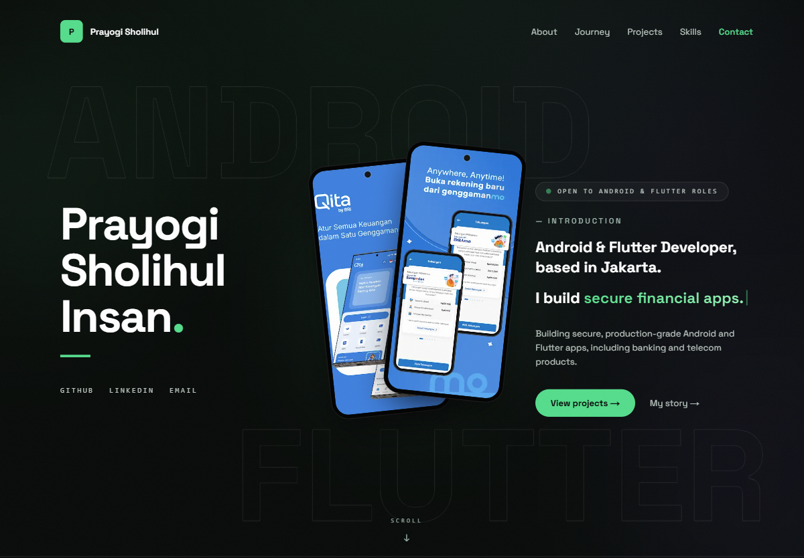

# Prayogi Sholihul Insan · Portfolio

Android & Flutter developer portfolio — dark, fast, and animated.



**Stack:** Next.js 15 (App Router) · React 19 · TypeScript · Tailwind CSS v4 ·
GSAP ScrollTrigger · Lenis smooth scroll · Framer Motion · Space Grotesk

## Sections

Hero with parallax phone mockups and a typewriter intro · tech marquee ·
About · scroll-driven career journey · pinned horizontal project gallery with
real Play Store screenshots · skills & Dicoding certifications · contact · footer

## Run locally

```bash
npm install
npm run dev
```

Open http://localhost:3000.

## Deploy

Push to GitHub, then import the repo in [Vercel](https://vercel.com) (free tier).
No extra configuration needed — every push to `main` redeploys automatically.

## Content

All editable content lives in `data/`:

- `profile.json` — name, title, tagline, contact links, education, activities
- `experience.json` — career journey entries
- `projects.json` — project cards (screenshots listed in `screenshots.ts`)
- `skills.json`, `certifications.json`
- `screenshots.ts` — screenshot lists per project, hero images, captions

App screenshots live in `public/images/projects/<slug>/` and are sourced from
the official Google Play Store listings (linked from each project card).
